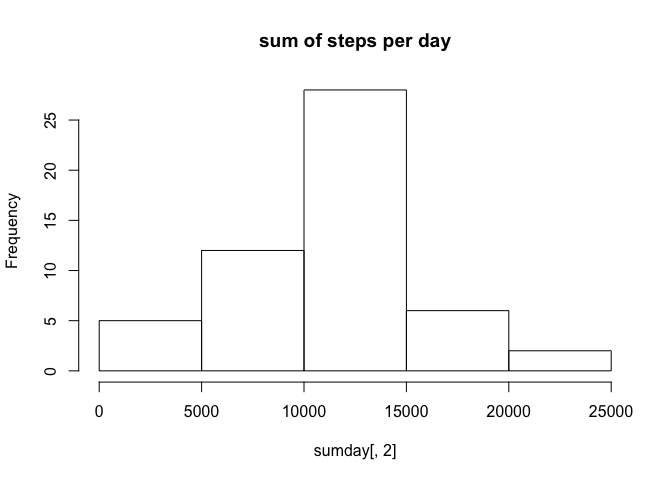
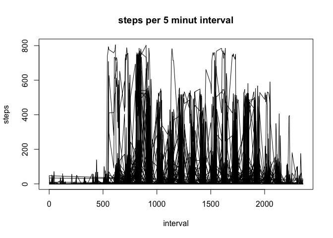
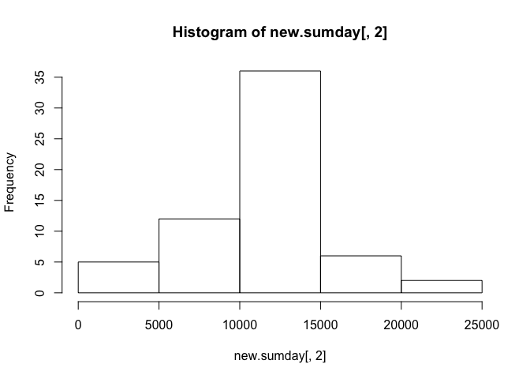
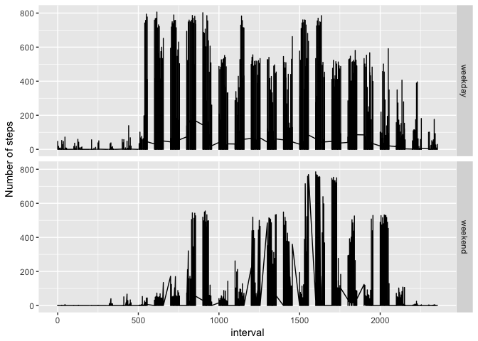

# Untitled
Wiktoria Urantowka  
7/24/2017  
#Reporoducuble Research#
##Project 1##


1. Code for reading in the dataset & loading packages

```r
rm(list=ls())
setwd("/Users/quora1/Desktop/DataScience/5_Reproducible_Research/workDir")
library("zoo")
```

```
## 
## Attaching package: 'zoo'
```

```
## The following objects are masked from 'package:base':
## 
##     as.Date, as.Date.numeric
```

```r
library("ggplot2")
data<-read.csv("./activity.csv",stringsAsFactors=FALSE) 
head(data)
```

```
##   steps       date interval
## 1    NA 2012-10-01        0
## 2    NA 2012-10-01        5
## 3    NA 2012-10-01       10
## 4    NA 2012-10-01       15
## 5    NA 2012-10-01       20
## 6    NA 2012-10-01       25
```

2. Histogram of the total number of steps taken each day


```r
sumday<- aggregate(data$steps, list(date = data$date), sum)
hist(sumday[,2], main = "sum of steps per day")
```

<!-- -->

3. Mean and median number of steps taken each day

```r
mean <-mean(sumday[,2],na.rm=TRUE)
median <-median(sumday[,2],na.rm=TRUE)
mean
```

```
## [1] 10766.19
```

```r
median
```

```
## [1] 10765
```

4. Time series plot of the average number of steps taken

```r
with(data,plot(interval, steps, type="l", main='steps per 5 minut interval'))
```

<!-- -->

5. The 5-minute interval that, on average, contains the maximum number of steps

```r
sum_interval<- aggregate(data$steps, list(interval = data$interval), sum,na.rm=TRUE)
max_step_interval<-sum_interval$interval[which.max(sum_interval$x)]
max_step_interval
```

```
## [1] 835
```

6. Code to describe and show a strategy for imputing missing data
 
 Replacing NA by interval mean

```r
new<-na.aggregate(data$steps, by = data$interval)
data[,1] <- new
head(data)
```

```
##       steps       date interval
## 1 1.7169811 2012-10-01        0
## 2 0.3396226 2012-10-01        5
## 3 0.1320755 2012-10-01       10
## 4 0.1509434 2012-10-01       15
## 5 0.0754717 2012-10-01       20
## 6 2.0943396 2012-10-01       25
```

7. Histogram of the total number of steps taken each day after missing values are imputed

```r
new.sumday<- aggregate(data$steps, list(date = data$date), sum)
hist(new.sumday[,2])
```

<!-- -->
 Please note, after replacing NA by mean values, mean and median are equal.

```r
mean <-mean(new.sumday[,2])
median <-median(new.sumday[,2])
mean
```

```
## [1] 10766.19
```

```r
median
```

```
## [1] 10766.19
```

8 Panel plot comparing the average number of steps taken per 5-minute interval across weekdays and weekends (and the steps required for it's computation)

```r
weekday<-as.POSIXlt(data$date)$wday
data[,4]<-as.numeric(weekday)
data$weektime<- ifelse(data$V4 >= 6, "weekend", "weekday")
data$weektime<-as.factor(data$weektime)
qplot(interval,steps,data=data,geom="line",facets=weektime~., ylab= "Number of steps",type = "𝚕")
```

```
## Warning: Ignoring unknown parameters: type
```

<!-- -->

Note, There is more variation in the average number of steps taken during the weekend than during the week days.


